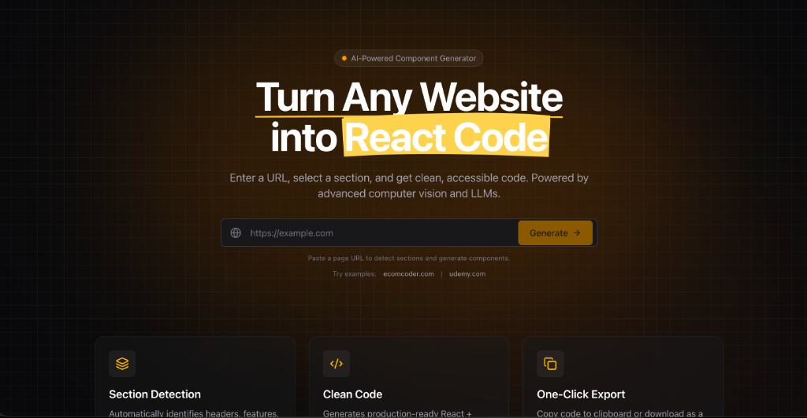

# Website2Code - AI-Powered Web Component Generator




> **Turn any website section into clean, editable React code instantly.**  
> Built with Next.js, Playwright, and Google Gemini 2.5 Flash.

**Live Demo**: [https://ecomcoder-assignment-production.up.railway.app/](https://ecomcoder-assignment-production.up.railway.app/)

## 🚀 What I Built

**Website2Code** is an intelligent development tool that bridges the gap between *design* (the web as it exists) and *code* (the components you need).

Instead of manually inspecting elements and copying styles, you simply paste a URL. The system analyzes the page, breaks it into semantic sections (Heroes, Features, Footers), and uses advanced computer vision to generate **pixel-perfect React + Tailwind CSS code**.

It’s not just an HTML dumper—it’s an **AI Pair Programmer** that creates self-contained, interactive, and responsive components ready for production use.

---

## 🏗️ Architecture Overview

The app is built on a modern **Next.js 14+** stack, designed for speed and reliability.

| Component | Tech Stack | Role |
|-----------|------------|------|
| **Frontend** | Next.js (App Router), Tailwind CSS v4 | The interactive dashboard and split-view editor. |
| **Scraper** | **Playwright** + Cheerio | Runs a headless browser to capture screenshots and DOM structure. |
| **AI Engine** | **Google Gemini 2.5 Flash** | The "Brain" that translates visual screenshots into React code. |
| **Sandbox** | **Sandpack** (CodeSandbox) | Provides a secure, in-browser runtime to preview generated code. |

---

## 🛠️ How It Works (Deep Dive)

### 1. The "Stealth" Scraping Engine
The scraping pipeline (`lib/scraper`) is more than just `page.goto()`. To handle modern web protections and ensure high-quality captures, I implemented:
*   **Semantic Section Detection**: Instead of just grabbing `divs`, the scraper specifically looks for semantic tags (`<header>`, `<section>`, `<footer>`) and uses **viewport geometry** heuristics to group related elements.
*   **Stealth Mode**: Custom scripts mock `navigator.webdriver` and user-agent strings to bypass Cloudflare and other bot protections.
*   **DOM Cleaning**: Before sending HTML to the AI, we strip out script tags, hydration attributes (`bis_skin_checked`), and SVG paths to reduce token usage and noise.

### 2. AI Prompting & "Design DNA"
We don't just ask the AI to "copy this." Our prompt strategy (`lib/ai/prompts.ts`) forces the model to extract the **"Design DNA"** first:
1.  **Analyze**: Look at the screenshot to determine roundness (pill vs. square), shadow depth, and color palette.
2.  **Structure**: Use the raw HTML to understand nesting and text content.
3.  **Generate**: Output self-contained React code using *only* standard Tailwind classes and Lucide icons.

### 3. The "Parser" Middleware (Safety Layer)
LLMs often hallucinate imports that break client-side previews (like `import Image from 'next/image'`). I built a robust **Parsing Engine** (`lib/ai/parser.ts`) that intercepts the AI code before it reaches the browser:
*   **Sanitization**: Automatically removes `next/link`, `next/image`, and arbitrary file imports.
*   **Auto-Stubbing**: If the AI uses a component (e.g., `<FeaturesCard />`) but forgets to define it, the parser **injects a dummy definition** automatically. This prevents "Element type is invalid" crashes and allows the rest of the UI to render.

---

## 📖 Technical Implementation (Q&A)

### What was the hardest part?
The hardest part was **creating a stable "Sandboxed" Preview Environment**. AI models are trained on modern Next.js examples, so they aggressively try to import `next/image` or use server-side features. This constantly crashed the client-side Sandpack preview.
**Solution**: I built the regex-based **Parser Middleware**. It acts as a firewall, stripping incompatible code and converting framework-specific tags (like `<Image>`) into standard HTML (``) in real-time.

### How did you decide component boundaries?
I used **Playwright's DOM inspection** capabilities combined with a "screen real estate" heuristic.
*   First, we look for semantic high-level tags (`<section>`, `<main>`).
*   If those aren't present (common in `<div>` soup apps), we calculate the height and width of top-level elements. If a container spans 80%+ of the viewport width and has significant content, it's identified as a "Section."

### What broke, and how did you handle it?
1.  **Hydration Mismatches**: Browser extensions (like Grammarly) injected random attributes into the DOM during scraping.
    *   *Fix*: I added a HTML sanitization pass that removes known extension attributes before the AI ever sees the code.
2.  **Infinite Loaders**: Network timeouts sometimes left the UI spinning forever.
    *   *Fix*: Implemented strict `AbortController` timeouts (60s) and global error boundaries to reset UI state on failure.

### How did you use AI in your workflow?
My workflow was highly structured to ensure the AI acted as an accelerator rather than a source of technical debt:

1.  **Analytical Pre-computation**: I spent the first 10-15 minutes mentally deconstructing the problem statement, exploring different architectural trade-offs, and researching state-of-the-art scraping and sandboxing techniques before generating any code.
2.  **Architectural Mapping**: I used **Traycer.ai** to generate a high-level product management and architectural map based on the core project requirements. I then manually refined this "map" to ensure every technical edge case was addressed.
3.  **Layered Development**: Instead of asking for a monolithic solution, I used **Cursor** to initialize the boilerplate and then built the system layer-by-layer (Scraper -> AI Pipeline -> Sandbox). This modular approach allowed me to direct the AI with surgical precision and avoid time-wasting debugging loops.
4.  **Refinement & "De-slopping"**: I utilized **skills.sh** as a final pass to remove "AI slop" (generic boilerplate or redundant logic), ensuring the final codebase remained sharp and professional.
5.  **UI Acceleration**: I leveraged the **Gemini 3.0 Pro** model within the **Antigravity** environment to iterate on the UI aesthetics at extreme speed, achieving a premium look and feel without traditional CSS bottlenecking.

---

## ⚙️ Getting Started

### Prerequisites
- Node.js 18+
- A Google Cloud/AI Studio API Key

### Installation

1. **Clone the repository**:
   ```bash
   git clone <repo-url>
   cd website2code
   ```

2. **Install dependencies**:
   ```bash
   npm install
   npx playwright install chromium
   ```

3. **Configure Environment**:
   Copy `.env.example` to `.env.local` and add your Google Gemini API key:
   ```bash
   cp .env.example .env.local
   ```
   ```env
   GEMINI_API_KEY=your_key_here
   ```

4. **Run Development Server**:
   ```bash
   npm run dev
   ```
   Open `http://localhost:3000` to start.

---

## ⚠️ Known Limitations

*   **Complex Interactions**: Highly interactive elements like Canvas/WebGL 3D maps cannot be replicated in React/CSS.
*   **Auth Walls**: While we have basic stealth, hard login walls or CAPTCHAs will block the scraper.
*   **Asset Hotlinking**: Images are currently linked directly to the source website. If the site employs hotlink protection, images may appear broken (403 errors).

---

Built by **Harshit Malik**.
